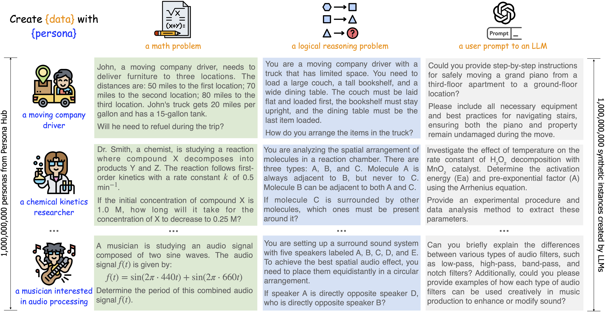

# [Scaling Synthetic Data Creation with 1,000,000,000 Personas](https://arxiv.org/pdf/2406.20094)

<div align="center">
  <a href="https://arxiv.org/pdf/2406.20094"></a>
  <a href="https://huggingface.co/datasets/proj-persona/PersonaHub"></a>
  <a href="https://creativecommons.org/licenses/by-nc-sa/4.0/"></a>
  <a href="https://opensource.org/licenses/MIT"></a>
</div>

## News

- \[07/08/2024\] 🚀🚀🚀 Added code to <a href="#run-demo">demo</a> persona-driven data synthesis using gpt-4o (openai) or open-sourced models (vllm)
- \[06/30/2024\] 🚀🚀🚀 Initial announcement of the paper and initial release of PERSONA HUB and synthetic data samples


## Introduction
We propose a novel persona-driven data synthesis methodology that leverages various perspectives within a large language model (LLM) to create diverse synthetic data. To fully exploit this methodology at scale, we introduce **PERSONA HUB** – a collection of **1 billion diverse personas** automatically curated from web data. These 1 billion personas (~13% of the world's total population), acting as distributed carriers of world knowledge, can tap into almost every perspective encapsulated within the LLM, thereby facilitating the creation of diverse synthetic data at scale for various scenarios. By showcasing PERSONA HUB’s use cases in synthesizing high-quality **mathematical and logical reasoning** problems, **instructions** (i.e., user prompts), **knowledge-rich texts**, **game NPCs** and **tools** (functions) at scale, we demonstrate persona-driven data synthesis is versatile, scalable, flexible, and easy to use, potentially driving a paradigm shift in synthetic data creation and applications in practice, which may have a profound impact on LLM research and development.

<div align="center">

</div>


## Data Release
### Synthetic Data Samples
To facilitate research in persona-driven data synthesis, we are initially releasing following synthetic data samples we created with various personas, including:
* **50,000 math problems**
* **50,000 logical reasoning problems**
* **50,000 instructions**
* **10,000 knowledge-rich texts**
* **10,000 game NPCs**
* **5,000 tools (functions)**

### Persona Hub
We also release a subset of our PERSONA HUB, including:
* **200,000 personas**

One can also quickly preview these data at [huggingface](https://huggingface.co/datasets/proj-persona/PersonaHub).

## Run Demo
One can try the demo to synthesize data with PERSONA HUB by simply running:

```bash
# ensure that you have installed datasets and openai (pip install datasets openai) and configured the openai_api_key before running
bash demo_openai_synthesize.sh # using gpt4o to synthesize data with PERSONA HUB
```

or

```bash
# ensure that you have installed datasets, transformers and vllm (pip install datasets transformers vllm) before running
bash demo_vllm_synthesize.sh # using open-sourced models to synthesize data with PERSONA HUB
```

Note that the data synthesis prompt templates we provide are for reference only. You can customize your desired prompts in `code/prompt_templates.py`.

## Contact
Please email `xinchan@global.tencent.com` or `dyu@global.tencent.com`

## Disclaimer
PERSONA HUB can facilitate synthetic data creation at a billion-scale to simulate diverse inputs (i.e., use cases) from a wide variety of real-world users. If this data is used as input to query a target LLM to obtain its outputs at scale, there is a high risk that the LLM's knowledge, intelligence and capabilities will be dumped and easily replicated, thereby challenging the leading position of the most powerful LLMs. It is crucial to avoid misuse and ensure ethical and responsible application to prevent privacy violations and other ethical concerns.

The released data is all generated by public available models (GPT-4, Llama-3 and Qwen), and is intended for research purposes only. Users also must comply with the respective license agreements and usage policies of these models when using the synthesized data. The data may contain inaccuracies, unsafe content, or biases, for which we cannot be held responsible. Please evaluate its accuracy and suitability before use. Tencent and its licensors provide the data AS-IS, without warranty of any kind, express or implied. The views and opinions expressed in the data do not necessarily reflect those of Tencent.

## Star History
[](https://star-history.com/#tencent-ailab/persona-hub&Date)
